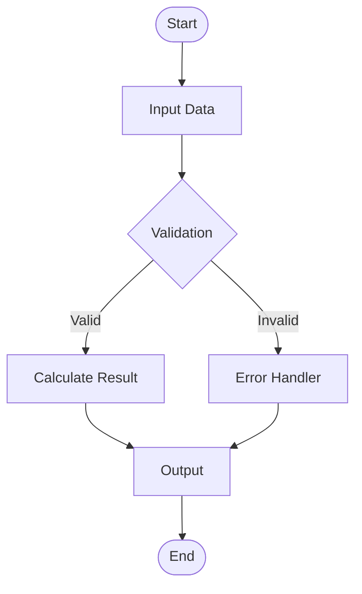
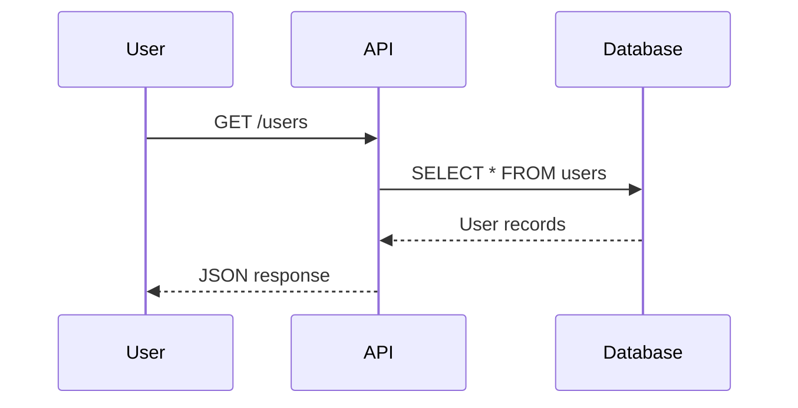
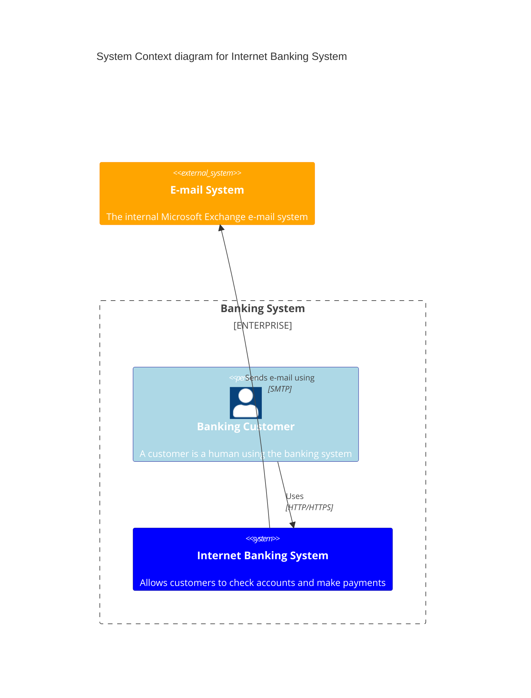

## Quick Reference (30 seconds)

# Skill: Mermaid Diagram Expert v7.0.0-skill-edition

Pure skill-based Mermaid rendering for Claude Code with MCP Playwright integration.

# Quick Start (2 minutes)

## How to Use This Skill in Claude Code

### Basic Usage

```
Skill("moai-library-mermaid")
```

This skill provides:
1. Complete Mermaid syntax for all 21 diagram types
2. MCP Playwright integration for rendering SVG/PNG
3. Ready-to-use examples and reference documentation
4. Enterprise diagram patterns and best practices

### Supported Diagram Types (21)

#### Structural Diagrams
- Flowchart - Process flows and decision trees
- Sequence - Interaction sequences and message flows
- Class - Object-oriented class relationships
- ER - Entity-relationship databases
- Block - Block diagram structures
- State - State machines and stateful flows

#### Timeline & Tracking
- Timeline - Chronological events and milestones
- Gantt - Project scheduling and timelines
- Gitgraph - Git workflow and branching

#### Architecture & Design
- C4 - Context, Container, Component, Code architecture
- Architecture - System architecture diagrams
- Requirement - Requirements and traceability

#### Data Visualization
- Pie Chart - Pie and donut charts
- XY Chart - Scatter and line charts
- Sankey - Flow diagrams with proportional width
- Radar - Multi-variable comparison charts

#### User & Process
- Mindmap - Hierarchical mind mapping
- User Journey - User experience flows
- Kanban - Kanban board states
- Packet - Network packet structures

# Usage in Claude Code

## Step 3: Render with MCP Playwright

Once you have your Mermaid code:

```python
# This skill integrates with MCP Playwright
# You can use the playwright MCP server to render the diagram
# The MCP server is configured in .mcp.json
```

The MCP configuration in `.mcp.json` enables:
```json
{
  "mcpServers": {
    "playwright": {
      "command": "npx",
      "args": ["-y", "@playwright/mcp@latest"]
    }
  }
}
```

# All 21 Diagram Types Reference

See `examples.md` for complete working examples of all 21 diagram types.

## State Management (State Diagram Example)

```
Idle → Processing → Complete
 ↓ ↓ ↑
Error 
```

# Learning Resources

- Official Site: https://mermaid.js.org
- Live Editor: https://mermaid.live
- Syntax Guide: https://mermaid.js.org/syntax/
- Examples: See `examples.md` and `reference.md` in this skill

# Support

For Mermaid syntax questions:
- Check `examples.md` for working examples
- Review `reference.md` for official documentation links
- Use https://mermaid.live for interactive testing

For Claude Code integration:
- Ensure `.mcp.json` has Playwright configured
- Verify Node.js is installed (`node --version`)
- Check Playwright is available (`npx @playwright/mcp@latest --version`)

Version: 6.0.0-skill-edition
Last Updated: 2025-11-20
Focus: Pure skill-based Mermaid rendering with MCP Playwright

## Implementation Guide

## Step 2: Get Mermaid Syntax

The skill provides complete syntax for your diagram type:

### Example: Flowchart



### Example: Sequence Diagram



### Example: C4 Architecture



## Categories

### 1. Process & Flow Diagrams (6 types)
- Flowchart
- Sequence
- State
- Timeline
- Gitgraph
- User Journey

### 2. Structure & Design (5 types)
- Class
- ER
- Block
- Architecture
- C4

### 3. Data & Analytics (4 types)
- Pie Chart
- XY Chart
- Sankey
- Radar

### 4. Planning & Organization (4 types)
- Gantt
- Mindmap
- Kanban
- Requirement

### 5. Network & Technical (2 types)
- Packet
- (Reserved for extensions)

# Best Practices

## 1. Clarity and Readability
- Use descriptive labels for all nodes
- Keep diagram complexity moderate (20-30 nodes max)
- Use consistent styling and color schemes

## 2. Performance
- For complex diagrams, consider breaking into multiple diagrams
- Use subgraphs to organize large flowcharts
- Limit text length in nodes

## 3. Accessibility
- Provide text alternatives for diagrams
- Use color + shape differentiation (not color alone)
- Include descriptive titles and legends

## 4. Organization
- Group related diagrams in directories
- Use consistent naming conventions
- Document diagram purposes in comments

# Integration with MoAI-ADK

This skill is designed for use within Claude Code during:

- Architecture phase (`/moai:1-plan`) - Design system diagrams
- Documentation phase (`/moai:3-sync`) - Create visual documentation
- Review phase - Communicate system design visually
- Onboarding - Help new team members understand architecture

# Common Patterns

## API Architecture (C4 Example)

```
System Context
 API Gateway
 Backend Services
 Database
 Cache Layer
```

## Microservices Flow (Sequence Example)

```
Client → API Gateway → Service A → Database
 → Service B → Cache
```

## Data Pipeline (Flowchart Example)

```
Extract → Transform → Load → Validate → Report
```

## Advanced Patterns

## Step 1: Invoke the Skill

```python
Skill("moai-library-mermaid")
```

## Context7 Integration

### Related Libraries & Tools
- [Mermaid](/mermaid-js/mermaid): Diagram and flowchart tool

### Official Documentation
- [Documentation](https://mermaid.js.org/intro/)
- [API Reference](https://mermaid.js.org/config/setup/modules/mermaidAPI.html)

### Version-Specific Guides
Latest stable version: 10.x
- [Release Notes](https://github.com/mermaid-js/mermaid/releases)
- [Migration Guide](https://mermaid.js.org/config/setup/modules/mermaidAPI.html)

---

## Works Well With

Agents:
- workflow-docs - Documentation with diagrams
- workflow-spec - SPEC diagrams
- design-uiux - Architecture visualization

Skills:
- moai-docs-generation - Documentation generation
- moai-workflow-docs - Diagram validation
- moai-library-nextra - Architecture docs

Commands:
- `/moai:3-sync` - Documentation with diagrams
- `/moai:1-plan` - SPEC with diagrams
